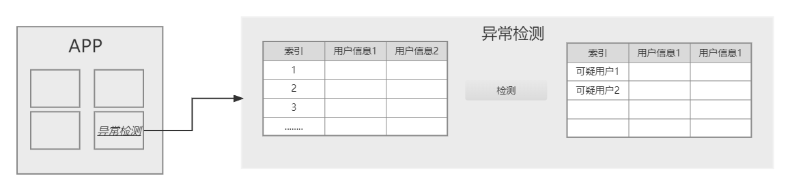

# 环境要求

 使用到的库：torch，numpy ，csv（版本无特殊要求）

# 如何使用：

## 使用

run.py会调用anomalu_detetion中的代码

## 结果说明

这两个是训练好的模型

- discriminator.pth

- generator.pth

anomalu_detetion中的代码会调用训练好的discriminator.pth的模型。

 运行程序之后会生成下面2个文件

- out_of_threshold_data.csv（检测出的异常数据）
- classified_data.csv（正常数据+异常数据）

---

# 窗口建议

可在默认的异常检测的“检测”按钮，上方添加阈值输入框，用于调整阈值

关于程序如何显示，已经生成了classified_data.csv，out_of_threshold_data.csv，两个文件，前者可以作为正常数据，后者可以作为异常数据。分别显示

> 注意:reshold=0.3默认，本文件并没有包含训练的代码